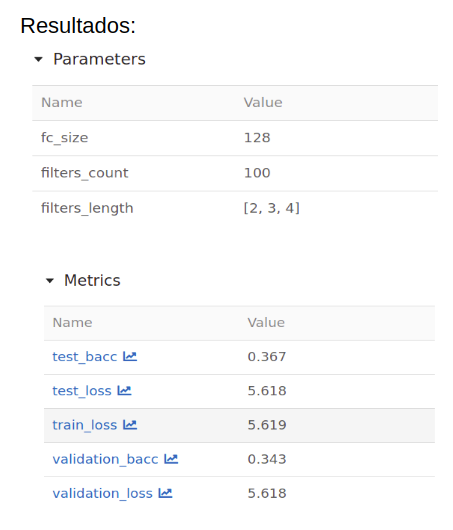

# Aprendizaje Profundo
Challenge MeLi 2019 para materia de Aprendizaje Profundo - DiploDatos 2020

Utilizamos dos tipo de redes neuronales (CNN y MLP) y realizamos tres
experimentos para cada una de ellas modificando los hiperparámetros.

## MLFlow - CNN-  Prueba 1

### Hiperparámetros usados:

Epochs = 3
Filter_count = 100
freeze_embedings=True

### Resultados obtenidos:

## MLFlow - CNN-  Prueba 2

### Hiperparámetros usados:

Epochs = 5
Filter_count = 150
freeze_embedings=True

### Resultados obtenidos:

Para esta prueba modificamos la cantidad de Epochs. Recordamos que la Epoch
define el número de veces que el algoritmo de aprendizaje funcionará en todo el
conjunto de datos de entrenamiento. Nuestra suposición fue que al aumentarlo,
obtendríamos mejores métricas como resultado. Pero este no fue el caso. Creemos
que quizás se debe aumentar significativamente el número de Epoch (teniendo en
cuenta el riesgo de overfitting) para que este hiperparámetro mejore la
performance de nuestra red.

Por otro lado, también aumentamos de 100 a 150 el hiperparámetro filter_count.
Sabemos que no existe un número correcto que podamos colocar en este punto,
debemos ir probando. Este aumento que realizamos no trajo cambios significativos
en nuestras métricas. Una vez más, quizás lo más beneficioso sería aumentarlo
de manera significativa, teniendo en cuenta el costo computacional que eso
conlleva.

## MLFlow - CNN-  Prueba 3

### Hiperparámetros usados:

Epochs = 3
Filter_count = 100
freeze_embedings= False

### Resultados obtenidos:

En este experimento decidimos no no utilizar freeze para nuestros embeddings.
Esto hizo que los mismos fueran menos consistentes. Al tener muchos datos con
los que trabajar, usar freeze podría ser lo correcto, ya que no corremos riesgo
de overfitting. Pero decidimos probar si el modelo mejoraba sacando el freeze.
Otra opción podría haber sido usar el “semi-freeze”, donde el embedding se
divide en dos, un grupo queda sin el freeze, y al otro grupo se le aplica,
generando un balance entre inconsistencia y overfitting.

## MLFlow - MLP -  Prueba 1

### Hiperparámetros usados y resultados obtenidos:

## MLFlow - MLP -  Prueba 2

### Hiperparámetros usados y resultados obtenidos:

Cambiamos el número de epoch de 3 a 5 y aumentamos las hidden layers a 256 y la
cantidad de iteraciones de aprendizaje de entrenamiento.
Podemos observar en este caso que las métricas obtenidas son mejores que las
anteriores, pero no han cambiado significativamente.

## MLFlow - MLP -  Prueba 3

### Hiperparámetros usados y resultados obtenidos:

## MLRuns files

[link to drive](https://drive.google.com/drive/u/2/folders/16MVGhUMJT5CdZKb4sRIz182Pim3euLNk)
